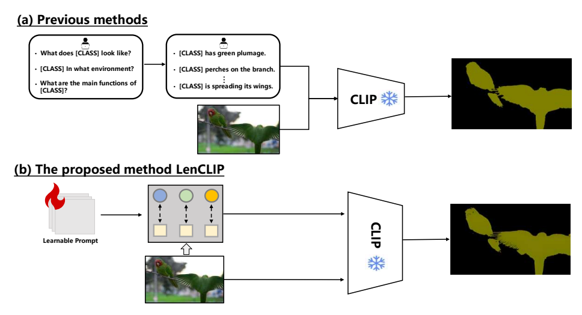
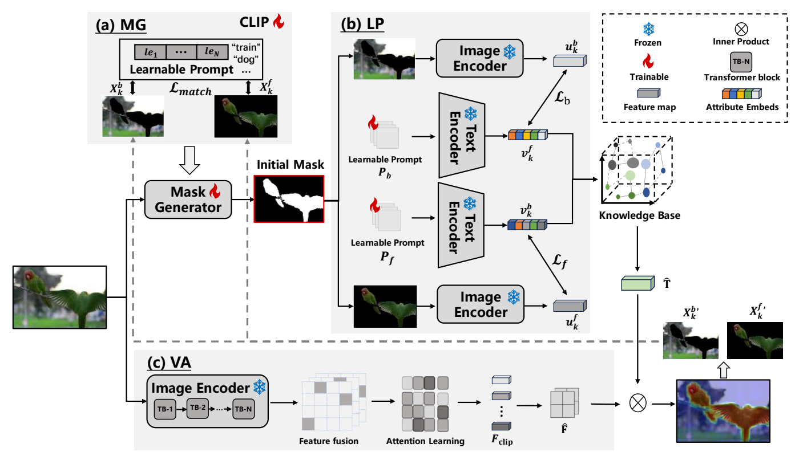
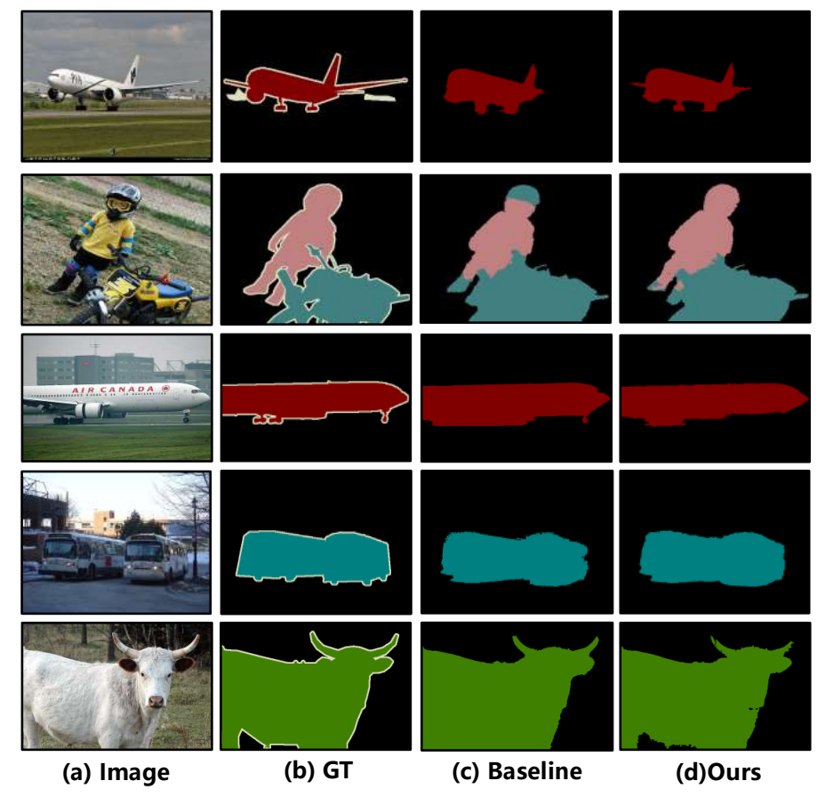
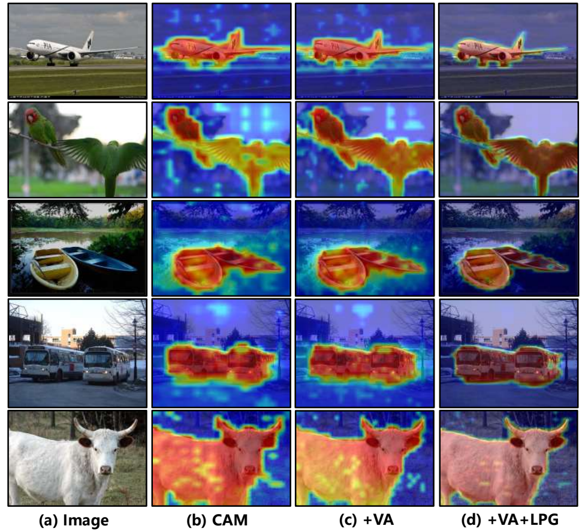

<div align="center">

# Foreground-Background Text Contrastive Learning<br>for Weakly Supervised Semantic Segmentation

**LenCLIP · Learnable Prompt Generation and Visual Alignment**

## Overview

**Motivation.** Fixed text templates provide coarse semantics that can miss object
parts and activate correlated backgrounds. LenCLIP learns category-aware
foreground/background prompts and uses their semantic responses to guide local
visual feature propagation.



**Framework.** LenCLIP connects three components:

- **Mask Generation (MG)** predicts category masks and separates foreground and
  background RGB regions through CLIP-guided image–text matching.
- **Language Prompt learning (LP)** learns foreground/background semantic contexts.
  MG and LP together form **Learnable Prompt Generation (LPG)**.
- **Visual Alignment (VA)** guides local feature propagation using semantic
  consistency, producing CAMs for online pseudo labels and segmentation learning.



CLIP image/text encoder weights are frozen. This implementation trains the prompts,
mask generator, feature-fusion adapter and segmentation decoder. Inference through
the segmentation decoder requires only RGB images, without image-level class tags.

The source is a manuscript-guided reconstruction. Explicit choices for ambiguous
formulas and unspecified implementation details are documented in
[`docs/IMPLEMENTATION.md`](docs/IMPLEMENTATION.md).

## Main Results

**mIoU (%) reported in Table 1 of the supplied paper.** These are paper-reported
values, not measurements produced by this README update.

| Dataset | Backbone | Val | Test |
|:---|:---|---:|---:|
| PASCAL VOC 2012 | CLIP ViT-B | **79.4** | **79.0** |
| MS COCO 2014 | CLIP ViT-B | **51.2** | — |

### Component Ablations

Table 2 reports the following VOC validation results (%):

| Condition | VA | LPG | Precision | Recall | mIoU |
|:---|:---:|:---:|---:|---:|---:|
| Baseline | — | — | 83.1 | 86.5 | 75.4 |
| With VA | ✓ | — | 83.6 | 87.2 | 76.3 |
| With LPG | — | ✓ | 86.4 | 87.3 | 77.4 |
| LenCLIP | ✓ | ✓ | **87.1** | **88.1** | **78.8** |

The main comparison and component-ablation tables report separate results:
79.4 and 78.8, respectively. Both values are retained as stated in the paper.

### Qualitative Results

The following figures are extracted from the supplied paper; this documentation
update does not regenerate the experiments.



<details>
<summary><b>CAM visualizations</b></summary>



</details>

## Data Preparation

The archive includes image-ID lists and image-level class-label dictionaries.
The default configurations use every image in their selected list:

| Dataset | Training list | Training images | Validation list | Validation images | Foreground classes |
|:---|:---|---:|:---|---:|---:|
| PASCAL VOC 2012 | `datasets/voc/train_aug.txt` | 10,582 | `datasets/voc/val.txt` | 1,449 | 20 |
| MS COCO 2014 | `datasets/coco/train.txt` | 82,081 | `datasets/coco/val.txt` | 40,137 | 80 |

These counts describe the lists actually bundled with this source. Training reads
RGB images and image-level labels; dense masks are opened only for evaluation.
Segmentation IDs are background 0, foreground 1..20 or 1..80, and ignored pixels 255.

### PASCAL VOC 2012

```text
data/VOCdevkit/VOC2012/
├── JPEGImages/
├── SegmentationClass/
└── SegmentationClassAug/

datasets/voc/
├── train_aug.txt
├── train.txt
├── val.txt
├── test.txt
└── cls_labels_onehot.npy
```

Provide all RGB images listed in `train_aug.txt`, including the augmented training
images. The official VOC train/validation image archive alone may require additional
SBD images to cover the selected list. Training does not read pixel masks.

Periodic validation uses `SegmentationClass/`, with `SegmentationClassAug/` as a
fallback when a mask is unavailable in the first directory. Set `train.eval_iters=0`
to disable validation during training.

### MS COCO 2014

```text
data/MSCOCO/
├── JPEGImages/
│   ├── train/                 # COCO_train2014_<12-digit-id>.jpg
│   └── val/                   # COCO_val2014_<12-digit-id>.jpg
└── SegmentationClass/
    └── val/                  # contiguous class-ID PNG masks
```

Images can alternatively be stored directly in `data/MSCOCO/train2014/` and
`data/MSCOCO/val2014/`. Preserve official image stems, matching the bundled lists.
COCO training does not require segmentation PNGs.

Use benchmark-compatible semantic masks with contiguous foreground IDs 1..80.
Raw COCO category IDs are not contiguous segmentation IDs. An optional converter
is supplied when masks must be generated from official instance annotations:

```bash
python -m pip install -r requirements-coco.txt
python scripts/prepare_coco_masks.py --annotations data/MSCOCO/annotations/instances_val2014.json --output data/MSCOCO/SegmentationClass/val
```

The converter draws smaller instances over larger ones and ignores uncovered crowd
pixels. The paper does not specify this conversion rule; use the same mask protocol
when comparing scores. Existing files are skipped unless `--overwrite` is supplied.

## Requirements

Run commands from the extracted `LenCLIIP-main/` directory. The supplied environment
recipe uses Python 3.10 and a matching PyTorch/torchvision installation:

```bash
conda create -n lenclip python=3.10 -y
conda activate lenclip
python -m pip install torch==2.2.2 torchvision==0.17.2 --index-url https://download.pytorch.org/whl/cu121
python -m pip install -r requirements.txt
```

The CUDA 12.1 wheels above are an example installation. Choose a compatible runtime
for the machine. The modified `clip/` package is bundled; no additional CLIP, MMCV,
MMSeg or Grad-CAM package is needed.

### Pretrained Encoder

Download the official CLIP ViT-B/16 checkpoint to `pretrained/ViT-B-16.pt`:

```bash
curl -L https://openaipublic.azureedge.net/clip/models/5806e77cd80f8b59890b7e101eabd078d9fb84e6937f9e85e4ecb61988df416f/ViT-B-16.pt -o pretrained/ViT-B-16.pt
```

Use `curl.exe` in Windows PowerShell. Dataset images, pretrained weights and trained
segmentation checkpoints are not bundled.

### Configure Paths

Edit `configs/lenclip_voc.yaml` or `configs/lenclip_coco.yaml`, or override fields
with `--set`. Relative resource paths resolve against the repository root.

```yaml
dataset:
  root_dir: /data/VOCdevkit/VOC2012
  name_list_dir: datasets/voc
model:
  clip_pretrain_path: pretrained/ViT-B-16.pt
train:
  work_dir: LenCLIP_runs/voc
```

The snippet shows fields to edit in the complete configuration. For COCO, use the
COCO root and `datasets/coco`. Windows paths can use forward slashes; quote paths
that contain spaces.

## Train LenCLIP

```bash
# PASCAL VOC 2012
CUDA_VISIBLE_DEVICES=0 python scripts/train_lenclip.py --config configs/lenclip_voc.yaml

# MS COCO 2014
CUDA_VISIBLE_DEVICES=0 python scripts/train_lenclip.py --config configs/lenclip_coco.yaml
```

On Windows, omit `CUDA_VISIBLE_DEVICES=0` and use `--device cuda:0` if needed.
Specify a separate output directory for each experiment:

```bash
python scripts/train_lenclip.py --config configs/lenclip_voc.yaml --work-dir LenCLIP_runs/voc_experiment --set dataset.root_dir=/data/VOCdevkit/VOC2012
```

| Setting | Value |
|:---|:---|
| Prompt context length | 30 |
| Matching suppression weight λa | 0.6 |
| LP suppression weight λb | 0.2 |
| LP objective weight λlp | 0.7 |
| Optimizer | AdamW, learning rate 1e-4, weight decay 1e-2 |
| Batch size | 4 |
| Training iterations in supplied configs | VOC: 30,000; COCO: 80,000 |
| Inference scales | 0.75, 1.0 |

Prompt length, loss weights, optimizer settings and inference scales follow the
paper. Iteration budgets and other unspecified settings are implementation choices;
see `docs/IMPLEMENTATION.md` for the distinctions.

The masked-region CLIP passes increase memory use. `train.batch_size` and
`model.region_batch_size` control batch sizes; the latter processes all positive
image/class pairs in chunks. Gradient checkpointing is enabled by default.

### Ablation Settings

The supplied configuration exposes the VA switch and loss weights. For example,
retain LPG and turn off VA propagation:

```bash
python scripts/train_lenclip.py --config configs/lenclip_voc.yaml --work-dir LenCLIP_runs/voc_without_va --set va.enabled=false
```

Run parameter studies in separate output directories:

```bash
python scripts/train_lenclip.py --config configs/lenclip_voc.yaml --work-dir LenCLIP_runs/voc_lambda_lp_01 --set loss.lambda_lp=0.1
python scripts/train_lenclip.py --config configs/lenclip_coco.yaml --work-dir LenCLIP_runs/coco_lambda_lp_01 --set loss.lambda_lp=0.1
```

Table 3 of the paper reports λlp = 0.1/0.3/0.5/0.7/0.9 with VOC mIoU
71.2/73.4/78.8/79.4/79.3, respectively. The module-ablation table above is a report
of the paper's experiments. The supplied source does not provide a dedicated LPG
removal switch; setting its loss weight to zero alone is not equivalent to removing
the prompt/mask modules or reproducing the paper's baseline.

### Resume and Training Outputs

```bash
python scripts/train_lenclip.py --config LenCLIP_runs/voc/LenCLIP_config.yaml --resume LenCLIP_runs/voc/checkpoints/LenCLIP_iter_2000.pth
```

Each checkpoint includes model/optimizer state, iteration, configuration and random
state. The data iterator restarts on resume, so minibatches are not guaranteed to
match an uninterrupted run. Training outputs include:

```text
LenCLIP_runs/voc/
├── LenCLIP_config.yaml
├── LenCLIP_train.log
├── LenCLIP_tensorboard/
├── LenCLIP_metrics_2000.json
└── checkpoints/
    ├── LenCLIP_iter_2000.pth
    └── LenCLIP_best.pth
```

Validation metrics and the best checkpoint require validation to be enabled.
The last training iteration always saves a checkpoint.

## Evaluate LenCLIP

### Semantic Segmentation

```bash
# VOC validation
python scripts/infer_lenclip.py --config LenCLIP_runs/voc/LenCLIP_config.yaml --checkpoint LenCLIP_runs/voc/checkpoints/LenCLIP_iter_30000.pth --split val --evaluate --output LenCLIP_predictions/voc

# COCO validation
python scripts/infer_lenclip.py --config LenCLIP_runs/coco/LenCLIP_config.yaml --checkpoint LenCLIP_runs/coco/checkpoints/LenCLIP_iter_80000.pth --split val --evaluate --output LenCLIP_predictions/coco
```

The default scales are 0.75 and 1.0; horizontal flipping is disabled unless
`--flip` is specified. Inference uses no image-level labels. Predictions are indexed
PNG masks and evaluation writes `LenCLIP_metrics.json`. Saved mIoU and class IoU
values are fractions in [0,1]; multiply by 100 to express percentages.

### Images and VOC Test Predictions

```bash
python scripts/infer_lenclip.py --config LenCLIP_runs/voc/LenCLIP_config.yaml --checkpoint LenCLIP_runs/voc/checkpoints/LenCLIP_iter_30000.pth --input /path/to/image.jpg --output LenCLIP_predictions/image
python scripts/infer_lenclip.py --config LenCLIP_runs/voc/LenCLIP_config.yaml --checkpoint LenCLIP_runs/voc/checkpoints/LenCLIP_iter_30000.pth --split test --output LenCLIP_predictions/voc_test
```

`--input` accepts one image or an image folder, without labels. VOC test images
must be prepared separately; omit `--evaluate` when ground truth is unavailable.
The paper's test score is not computed by local prediction export.

## Code Structure

```text
LenCLIIP-main/
├── README.md
├── docs/
│   ├── Chen.pdf                  # supplied paper
│   └── IMPLEMENTATION.md         # formulas and implementation choices
├── assets/                       # paper figures used in this README
├── LenCLIP_model/                # MG, LP, VA, feature adapter and decoder
├── clip/                         # adapted CLIP implementation and tokenizer
├── configs/                      # VOC and COCO YAML configurations
├── datasets/                     # image loader, split lists and image tags
├── scripts/                      # training, inference and mask conversion
├── utils/                        # losses, metrics, configs and checkpoints
└── pretrained/                   # place ViT-B-16.pt here
```

## Citation

Please refer to the supplied [LenCLIP paper](docs/Chen.pdf). Its title page does
not specify a publication year or venue:

```bibtex
@misc{chen_lenclip,
  title  = {Foreground-Background Text Contrastive Learning for Weakly Supervised Semantic Segmentation},
  author = {Chen, Hongyang and Niu, Xuexiang and Chen, Weiying and Wang, Hengyang and Wang, Lei},
  note   = {Supplied manuscript},
  url    = {https://github.com/chychychy123/LenCLIIP}
}
```

## Acknowledgement

The implementation builds on OpenAI CLIP and the supplied WeCLIP-related baseline
components. Attribution and existing terms are preserved in
[`THIRD_PARTY_NOTICES.md`](THIRD_PARTY_NOTICES.md).
